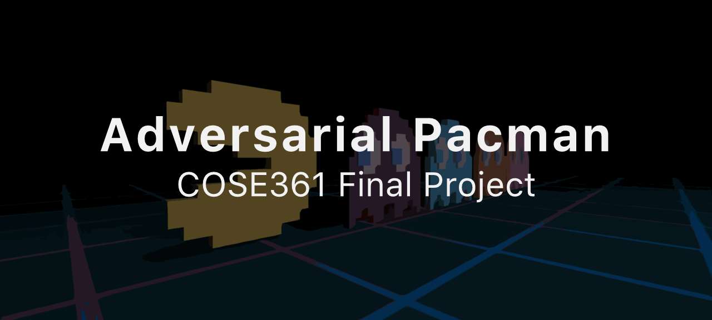
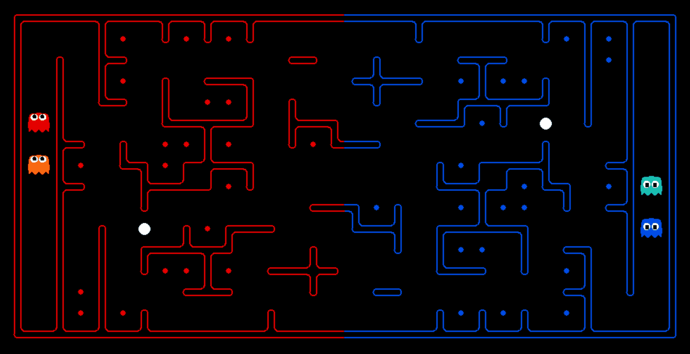
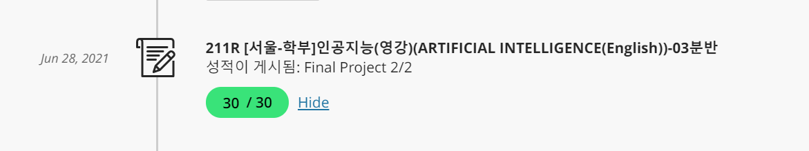

# **adversarial-pacman**





Adversarial pacman agent for final project in COSE361 (Artificial Intelligence), Korea University, Spring 2021. The course and project is based on [CS188](https://inst.eecs.berkeley.edu/~cs188/su21/), University of California at Berkeley.

## **Table of Contents**

- [**Description**](#description)
    - [Game Rule](#game-rule)
    - [Agent Design](#agent-design)
- [**Testing**](#testing)
    - [Environment Setup](#environment-setup)
    - [Making Competitons](#making-competitions)
- [**Results**](#results)


## **Description**

### Game Rule

<p><strong>Overview</strong><br>
Adversarial pacman is a multi-player variant of Pacman, involving two teams competing against each other. The team should eat the food on the other side of the map, while defending the food on the home side.</p>

<p><strong>Scoring</strong><br>
As pacman eats food dots on enemy side, they are removed from the map. When a pacman returns to home, one point per food is earned. If pacman gets eaten by a ghost, food dots it was carrying are deposited back to the map.</p>

For more detailed description about the game rules, check out the previous [CS188 website](https://inst.eecs.berkeley.edu/~cs188/sp10/projects/contest/contest.html).

### Agent Design

The team I submitted is consisted of two agents, `OffensiveAgent` and `DefensiveAgent` . They both use BFS, Astar and Minimax search for planning.

- `OffensiveAgent`
    - `OffensiveAgent` seeks for food which is far from the enemy ghosts.
    - This agent eats power pellet and hunts enemies when they are near enough.
    - This agent switches to minimax mode when enemy ghosts are nearby.
    - When the agent ate enough food or enemy is nearby, it always returns to home if it is possible.

- `DefensiveAgent`
    - `DefensiveAgent` defends homeland food and chases for enemy infiltrators.
    - This agent holds position on food which is closest to enemies.
    - When there are enemies in homeland, the agent start chasing to eat them.
    - When the agent is scared, it switches to minimax mode to avoid being hunted.


## Testing

### Environment Setup

`minicontest2.zip` includes file for running the game (it is from CS188 Berkeley.) Extract all the files to some directory.

Since the original code uses Python 3.6, you have to set the local Python version of extracted directory using [pyenv](https://github.com/pyenv/pyenv) (macOS, Linux) or [pyenv-win](https://github.com/pyenv-win/pyenv-win). Run the following commands inside the extracted directory.

```ps1
pyenv install 3.6.8
pyenv local 3.6.8
```

Then run `python capture.py` to test whether it works. Note that you might have to install some packages such as `numpy`. Use `pip` to install them.

```bash
python -m pip install --user numpy
```

### Making Competitions

Run `capture.py` to make competitions. The basic synopsis of `capture.py` is as follows.

```bash
python capture.py -r FILE1 -b FILE2 [-l RANDOM] [-t]
```

- `-r`
    - Red team file (not including `.py`.)
- `-b`
    - Blue team file (not including `.py`.)
- `-l RANDOM`
    - Each match is held on a randomly generated map.
- `-t`
    - Does not show graphics (useful only results are needed.)

For instance, you could make `your_best.py` compete against `baseline.py` on a random map like below.

```
python capture.py -r your_base -b baseline -l RANDOM
```

## **Results**



The submission got a full credit for the following reasons.

- The agents won against `baseline` in selected maps over 50% winning rate.
- The agents **ranked in 9th place** on the full league where submissions from all students were participated.
